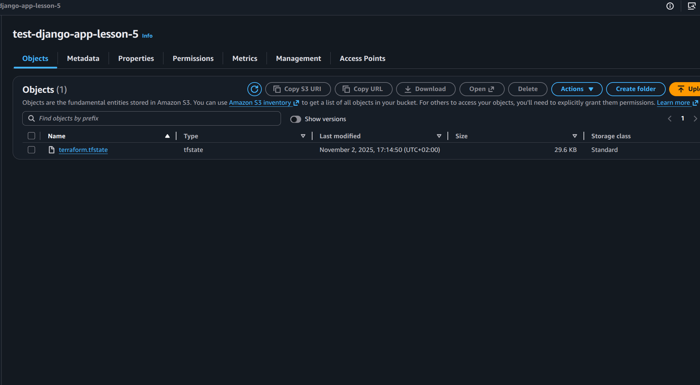
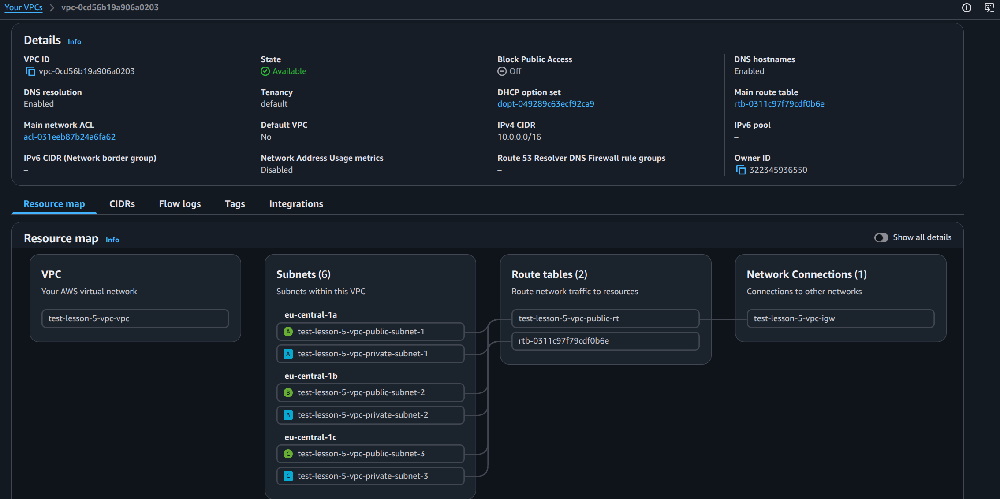
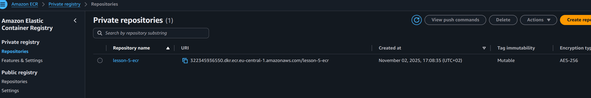

# Terraform 

## Prerequisites


- Terraform installed
- AWS credentials configured in user profile or in .aws/credentials file

For example:
```
[default]
aws_access_key_id = '123'
aws_secret_access_key = '123'
```

## S3 Backend

For S3 backend configuration, the following variables are required:

`bucket_name` - S3 bucket name for state storage
`table_name` - DynamoDB table name for state locking

Example:

```hcl
module "s3_backend" {
  source      = "./modules/s3-backend"
  bucket_name = "test-django-app-lesson-5"
  table_name  = "terraform-locks"
}
```

it is create terraform.tfstate file in S3 bucket to make state storage in S3 bucket
 and make it more secure with versioning and ownership

## VPC

For VPC configuration, the following variables are required:

`vpc_cidr_block` - CIDR for VPC (for example: "10.0.0.0/16")
`public_subnets` - List of CIDR blocks for public subnets (for example: ["10.0.1.0/24", "10.0.3.0/24", "10.0.5.0/24"])
`private_subnets` - List of CIDR blocs for private subnets (for example: ["10.0.2.0/24", "10.0.4.0/24", "10.0.6.0/24"])
`availability_zones` - List of availability zones for subnets (for example: ["eu-central-1a", "eu-central-1b", "eu-central-1c"])
`vpc_name` - Name of VPC (for example: "test-lesson-5-vpc")

Example:

```hcl
module "vpc" {
  source             = "./modules/vpc"
  vpc_cidr_block     = "10.0.0.0/16"
  public_subnets     = ["10.0.1.0/24", "10.0.3.0/24", "10.0.5.0/24"]
  private_subnets    = ["10.0.2.0/24", "10.0.4.0/24", "10.0.6.0/24"]
  availability_zones = ["eu-central-1a", "eu-central-1b", "eu-central-1c"]
  vpc_name           = "test-lesson-5-vpc"
}
```
It is create VPC with public and private subnets and internet gateway


## ECR

For ECR configuration, the following variables are required:

`ecr_name` - Name of ECR repository (for example: "lesson-5-ecr")
`scan_on_push` - Scan on push configuration for ECR repository (for example: true)

Example:

```hcl
module "ecr" {
  source       = "./modules/ecr"
  ecr_name     = "lesson-5-ecr"
  scan_on_push = true
}
```
It is create ECR repository with scan on push configuration


## Usage

To initialize the Terraform configuration:
```bash
terraform init
```

To create a plan:
```bash
terraform plan
```

To apply the configuration:
```bash
terraform apply
```


After apply you can find your ECR repository in AWS Console:


S3 Backend:


VPC:


ECR:



To destroy the resources:
```bash
terraform destroy
```


