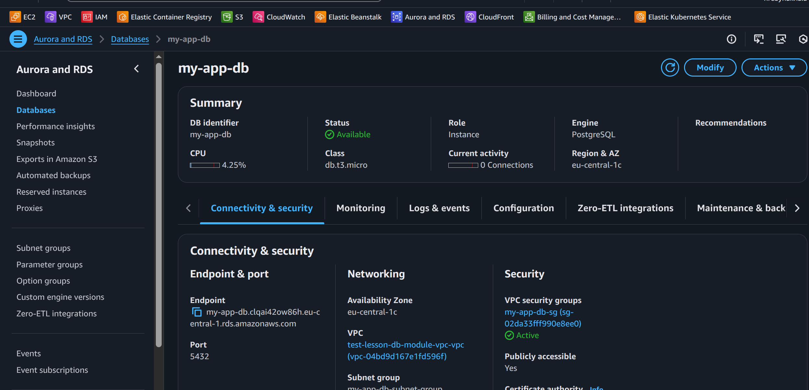
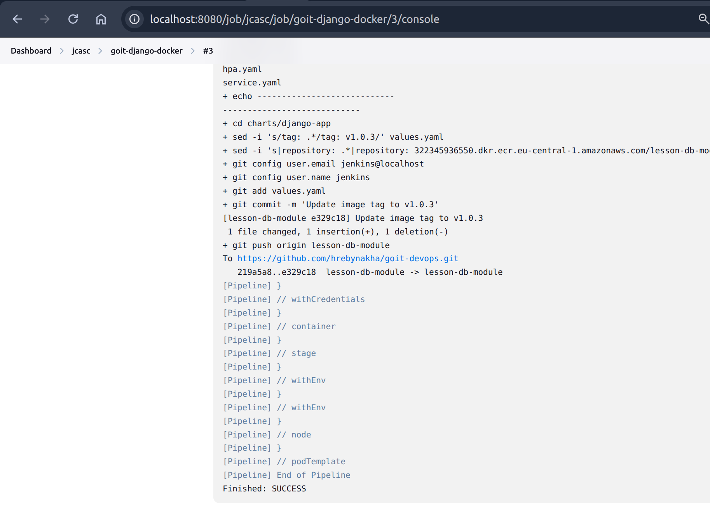
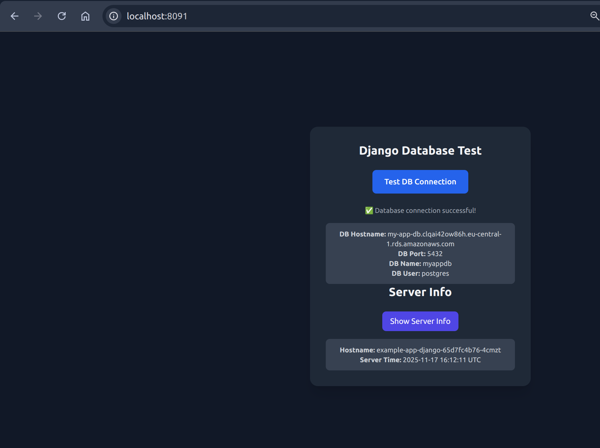

# Terraform

In terraform we add new module for RDS:

```hcl

module "rds" {
  source = "./modules/rds"

  name                  = "my-app-db"
  use_aurora            = false
  aurora_instance_count = 2
  # RDS
  engine                     = "postgres"
  engine_version             = "17.2"
  parameter_group_family_rds = "postgres17"
  # Aurora
  engine_cluster                = "aurora-postgresql"
  engine_version_cluster        = "15.3"
  parameter_group_family_aurora = "aurora-postgresql15"

  instance_class          = "db.t3.micro"
  allocated_storage       = 20
  db_name                 = "myappdb"
  username                = "postgres"
  password                = "admin123AWS23"
  subnet_private_ids      = module.vpc.private_subnets
  subnet_public_ids       = module.vpc.public_subnets
  publicly_accessible     = true
  vpc_id                  = module.vpc.vpc_id
  multi_az                = true
  backup_retention_period = 0
  parameters = {
    max_connections            = "200"
    log_min_duration_statement = "500"
  }
  tags = {
    Environment = "dev"
    Project     = "my-app-db"
  }
}

```

And also describe RDS module with Aurora in **modules/rds/rds.tf** and **modules/rds/aurora.tf**

After apply our changes:

```bash
terraform init
terraform plan
terraform apply
```

After all infrastructure is created we can see this output pods:


After database is created we can see this in AWS console:




and now we can connect our app to database using only Jenkins pipeline and ArgoCD:


# App Changes

Update our config in **settings.py** from sqlite to postgresql:

```python
POSTGRES_HOST = os.environ.get("POSTGRES_HOST", "localhost")
POSTGRES_PORT = os.environ.get("POSTGRES_PORT", "5433")
POSTGRES_DB = os.environ.get("POSTGRES_DB", "postgres")
POSTGRES_USER = os.environ.get("POSTGRES_USER", "postgres")
POSTGRES_PASSWORD = os.environ.get("POSTGRES_PASSWORD", "password")

DATABASES = {
    "default": {
        "ENGINE": "django.db.backends.postgresql",
        "HOST": POSTGRES_HOST,
        "PORT": int(POSTGRES_PORT),
        "NAME": POSTGRES_DB,
        "USER": POSTGRES_USER,
        "PASSWORD": POSTGRES_PASSWORD,
    }
}
```
Push and build with Jenkins pipeline:




# ArgoCD

For ArgoCD we use helm chart to deploy application and provide db connection values in values.yaml file:
```yaml
config:
  POSTGRES_PORT: 5432
  POSTGRES_HOST: dbhost.rds.amazonaws.com # from RDS module
  POSTGRES_USER: postgres
  POSTGRES_DB: myappdb
  POSTGRES_PASSWORD: dbpassword # from RDS module
```
To verify that connection is working we can forward port to local machine using `k9s` and open our application in browser:


