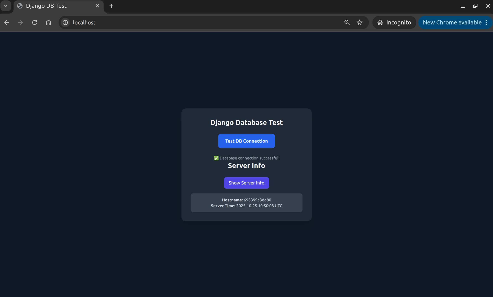

##  Dockerized Django application with PostgreSQL and Nginx

### Installation

1. Clone the repository
2. Copy the `.env.example` file to `.env`
3. Fill in the `.env` file with your database credentials
4. Run `docker compose up -d`

### Usage

1. Open `http://localhost` in your browser
2. Click on the "Test DB Connection" button
3. Click on the "Show Server Info" button

### Screenshots

### Stopping the containers

1. Run `docker compose down`
2. Remove the volumes with `docker compose down -v`

