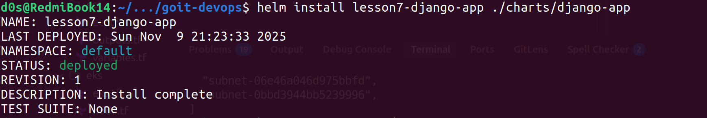
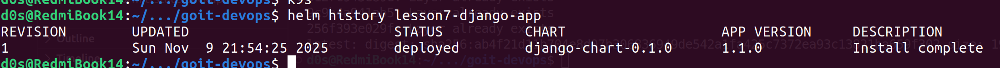
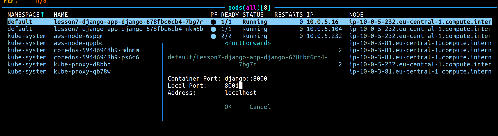
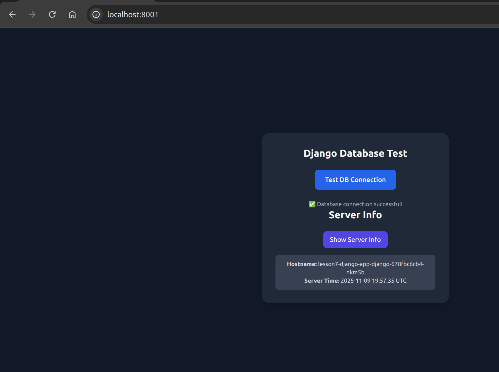
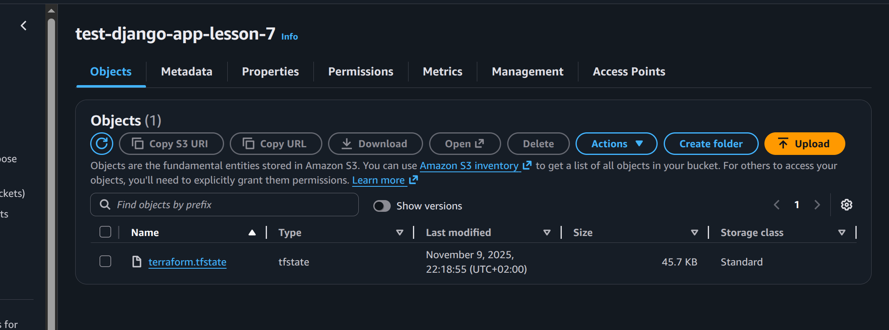

# Terraform

In terraform we add new module for EKS:

```hcl
module "eks" {
  source        = "./modules/eks"
  cluster_name  = "eks-lesson-7-ecr"
  subnet_ids    = module.vpc.public_subnets
  instance_type = "t3.micro"
  desired_size  = 2
  max_size      = 4
  min_size      = 2 // need at least 2 nodes to run other pods
}
```

And apply changes:

```bash
terraform init
terraform plan
terraform apply
```

Save ECR repository URL, it will be used in django app

In my case it is: `322345936550.dkr.ecr.eu-central-1.amazonaws.com/lesson-7-ecr`


# EKS
For EKS cluster we need to get kubeconfig file

`aws eks --region eu-central-1 update-kubeconfig --name eks-lesson-7-ecr`

Check if it is working:

`kubectl get nodes`


# Django App

Create image for django app and push it to ECR

`docker build -t 322345936550.dkr.ecr.eu-central-1.amazonaws.com/lesson-7-ecr:latest ./django`

Login to AWS:

`aws ecr get-login-password --region eu-central-1 | docker login --username AWS --password-stdin 322345936550.dkr.ecr.eu-central-1.amazonaws.com`

Push image to ECR:

`docker push 322345936550.dkr.ecr.eu-central-1.amazonaws.com/lesson-7-ecr:latest`


# Helm


helm repo add bitnami https://charts.bitnami.com/bitnami

helm repo update


Deploy django app to k8s cluster

`helm install lesson7-django-app ./charts/django-app`


Output:



Check if it is working via k9s:

`k9s`


After any changes in out config for helm ( like add HPA ) we need to update our deployment:

`helm upgrade lesson7-django-app ./charts/django-app`


All will be described in helm history command:

`helm history lesson7-django-app`

Output:




# Ports && Forwards

Apply port forward for django app using `k9s`:




Open app in browser:



And we successfully deployed our app to k8s cluster!


After all we can delete our cluster:

`helm delete lesson7-django-app`

And delete ECR repository:

`aws ecr delete-repository --repository-name lesson-7-ecr --force`

And destroy all resources:

`terraform destroy`


And also delete S3 bucket for terraform state:



