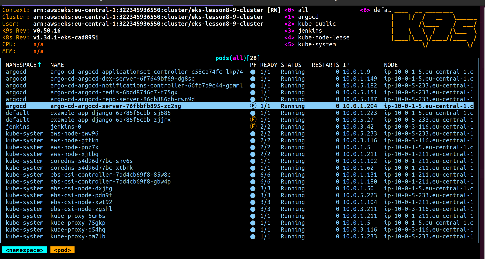
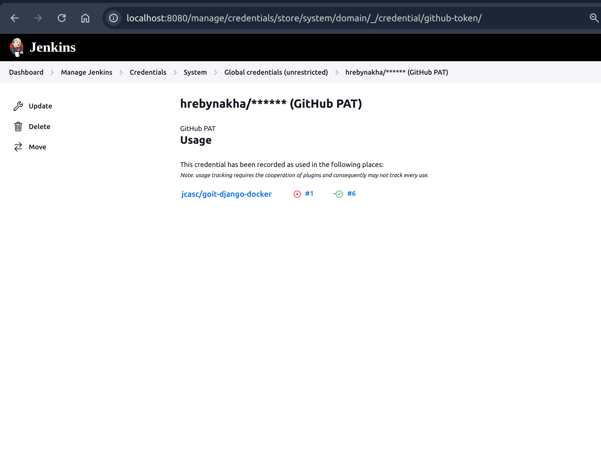
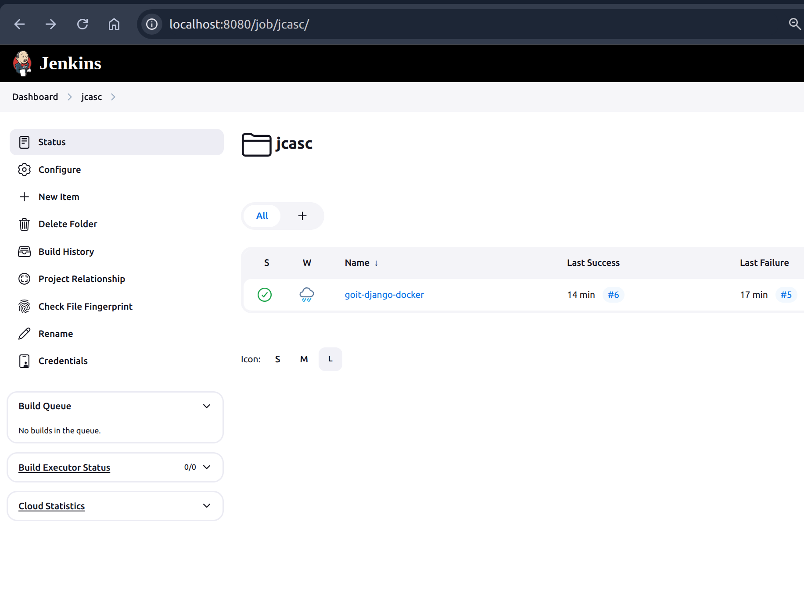
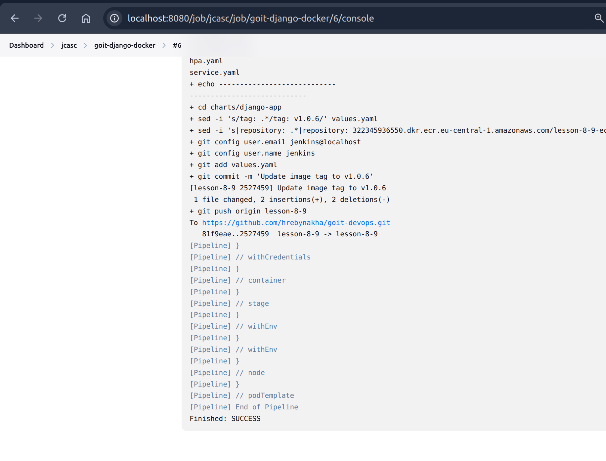
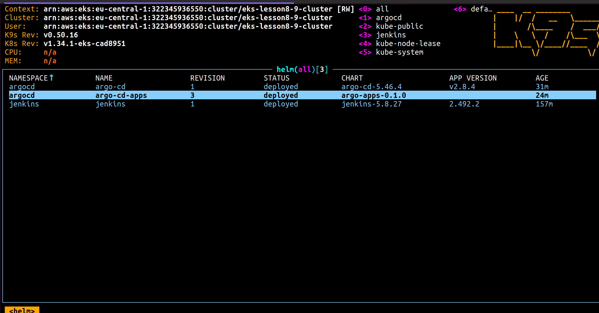
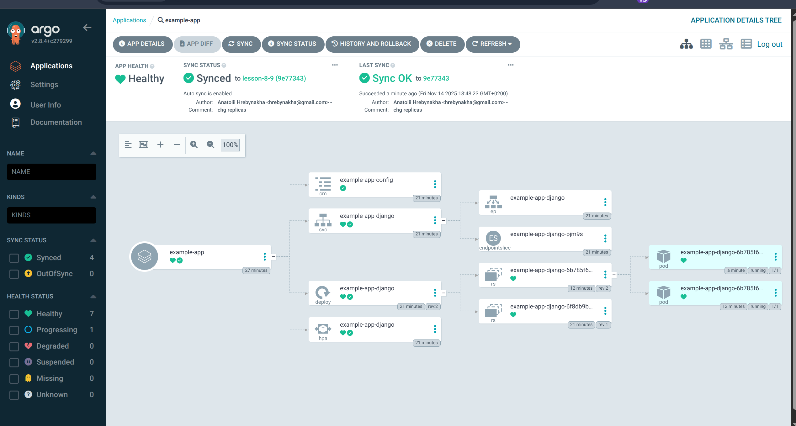
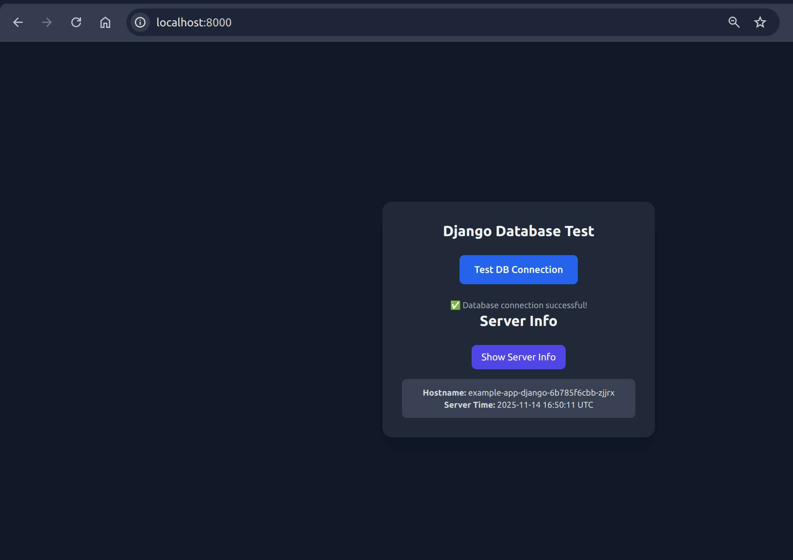

# Terraform

In terraform we add new module for EKS:

```hcl


data "aws_eks_cluster" "eks" {
  name = module.eks.eks_cluster_name

  depends_on = [module.eks]
}

data "aws_eks_cluster_auth" "eks" {
  name = module.eks.eks_cluster_name

  depends_on = [module.eks]
}

provider "kubernetes" {
  alias                  = "eks"
  host                   = data.aws_eks_cluster.eks.endpoint
  cluster_ca_certificate = base64decode(data.aws_eks_cluster.eks.certificate_authority[0].data)
  token                  = data.aws_eks_cluster_auth.eks.token
}

provider "helm" {
  kubernetes = {
    host                   = data.aws_eks_cluster.eks.endpoint
    cluster_ca_certificate = base64decode(data.aws_eks_cluster.eks.certificate_authority[0].data)
    token                  = data.aws_eks_cluster_auth.eks.token
  }
}


module "jenkins" {
  source       = "./modules/jenkins"
  cluster_name = module.eks.eks_cluster_name
  providers = {
    helm = helm
  }
  oidc_provider_arn = module.eks.oidc_provider_arn
  oidc_provider_url = module.eks.oidc_provider_url

  depends_on = [
    module.eks
  ]
}


module "argo_cd" {
  source        = "./modules/argo-cd"
  namespace     = "argocd"
  chart_version = "5.46.4"
}


```

And apply changes:

```bash
terraform init
terraform plan
terraform apply
```

After all infrastructure is created we can see this output pods:



Save ECR repository URL, it will be used to push image to ECR

In my case it is: `322345936550.dkr.ecr.eu-central-1.amazonaws.com/lesson-8-9-ecr`

and provide it to Jenkinsfile:

```Jenkinsfile
ECR_REGISTRY = "322345936550.dkr.ecr.eu-central-1.amazonaws.com"
IMAGE_NAME   = "lesson-8-9-ecr"
```

# EKS
For EKS cluster we need to get kubeconfig file

`aws eks --region eu-central-1 update-kubeconfig --name eks-lesson-7-ecr`

Check if it is working:

`kubectl get nodes`

After this we can comment our providers in main.tf file
and use the local config:

```hcl
provider "kubernetes" {
  config_path = "~/.kube/config"
}

provider "helm" {
  kubernetes = {
    config_path = "~/.kube/config"
  }
}
```

# Jenkins

Jenkins we autoconfigure using the JCasC


add credentials to jenkins:

```yaml
credentials: |
        credentials:
          system:
            domainCredentials:
              - credentials:
                  - usernamePassword:
                      scope: GLOBAL
                      id: github-token
                      username: hrebynakha
                      password: # provide your github token here
                      description: GitHub PAT
```

add new job to jenkins:

```yaml
jobs:
- script: |
    folder('jcasc') # create folder jcasc

- script: |
    pipelineJob("jcasc/goit-django-docker")  # create pipeline job
    ....
```


In Jenkins we can see this:
Credentials:


JCasC:



after this we can run pipeline job:



# ArgoCD

ArgoCD we autoconfigure using the  helm chart
In the  argocd module we provide values.yaml file with the values for the chart to add application automatically
```yaml
repositories:
  - name: goit-devops-django-app
    url: "https://github.com/hrebynakha/goit-devops.git"
    username: hrebynakha
    password: # provide your github token here
```
To verify that our helm chart was deployed we can use `k9s` to see it:



After argocd module was up by terraform and helm chart was deployed we can see application in argocd:




After application was synchronized and forwarding port to local machine we can see this:

