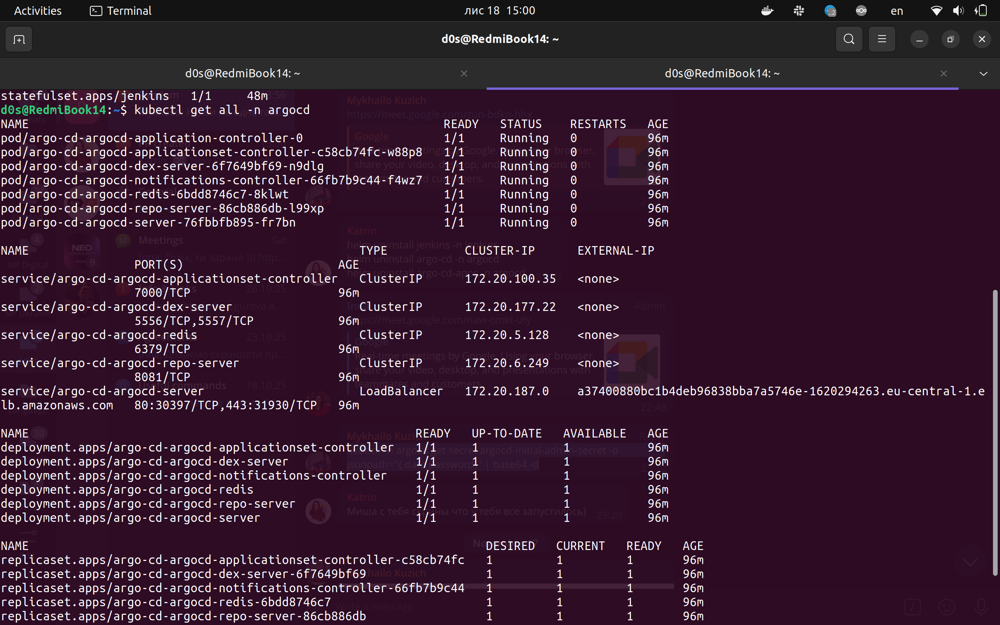
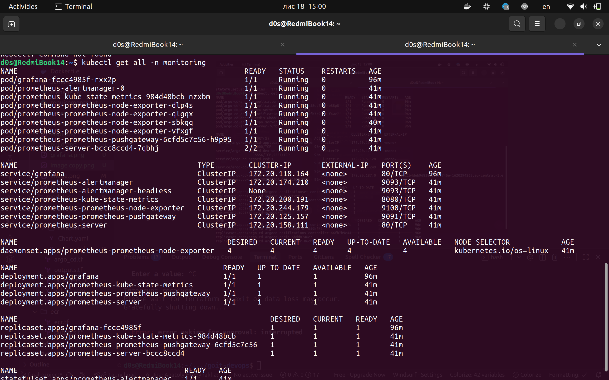
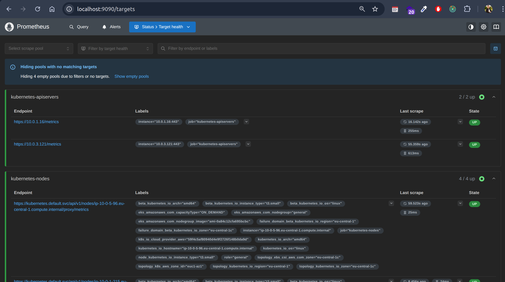
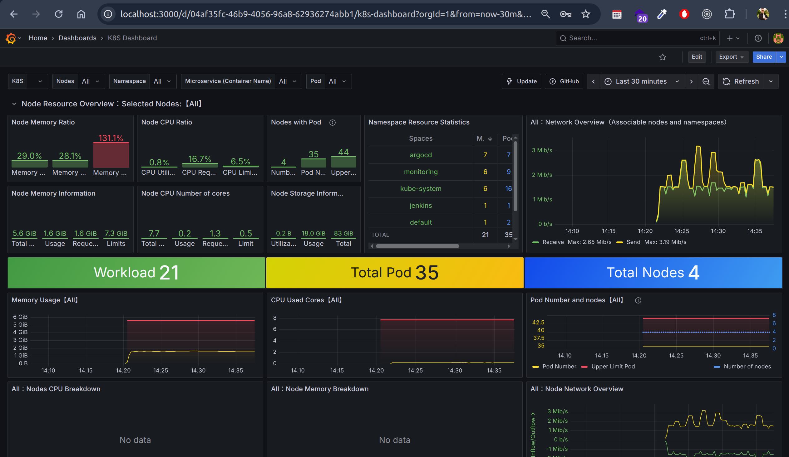
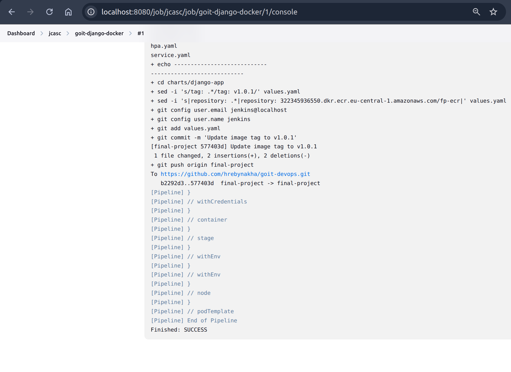

# Terraform

In terraform we add new module for monitoring using Grafana and Prometheus:

```hcl
module "monitoring" {
  source    = "./modules/monitoring"
  namespace = "monitoring"
}
```

And also describe monitoring module in **modules/monitoring/monitoring.tf**

Also add the secret file for make this project more secure:

Create the `secret.tfvars` file named

```
db_username = "postgres"
db_password = "NotRealPassword"
github_token = "ghp_someSecretToken123"
github_user  = "hrebynakha"
jenkins_password = "NotRealPassword"

```

When apply changes also add to param `-var-file="secret.tfvars"`:

```bash
terraform init
terraform plan -var-file="secret.tfvars"
terraform apply -var-file="secret.tfvars"
```


# Infrastructure


After infrastructure is created, we can check the our pods using kubectl:






# ArgoCD

Get ArgoCD admin password:

```
kubectl -n argocd get secret argocd-initial-admin-secret -o jsonpath="{.data.password}" | base64 -d;echo
```


# Monitoring


### Prometheus Metrics
To check the Prometheus metrics you can forward to local port prometheus server:



### Grafana
Get Grafana admin password:

```
kubectl get secret --namespace monitoring grafana \
    -o jsonpath="{.data.admin-password}" | base64 --decode ; echo

```


Forward port to local machine and open Grafana in browser:
After importing the dashboard, you can see the metrics in Grafana:




# App


Build the image with Jenkins:




After building the image, ArgoCD will automatically deploy it to the cluster.


And we can forward port to local machine and tets connection to DB using out app:


